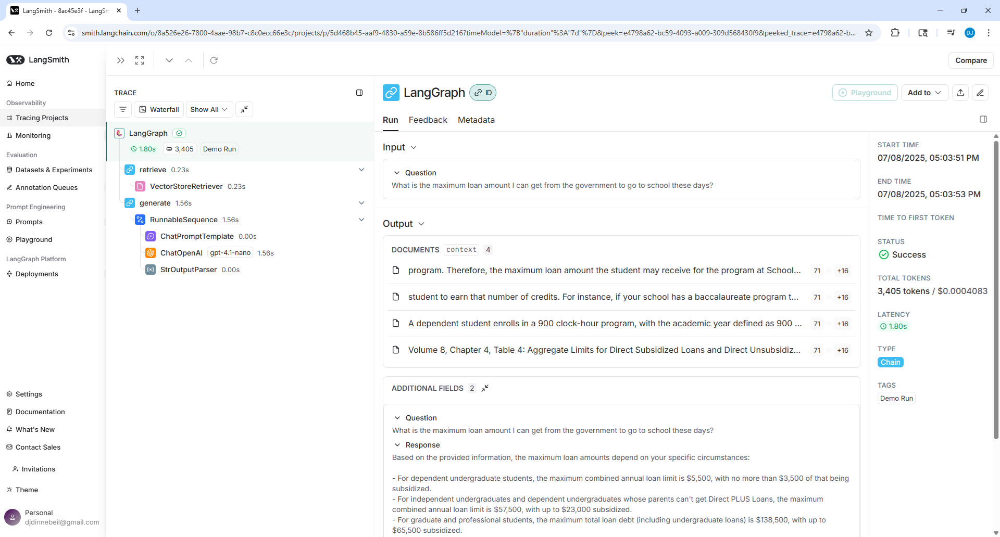

# Notebook for Assignment_Introduction_to_LCEL_and_LangGraph_LangChain_Powered_RAG.ipynb

##### 🏗️ Activity #1:

While there's nothing specifically wrong with the chunking method used above - it is a naive approach that is not sensitive to specific data formats.

Brainstorm some ideas that would split large single documents into smaller documents.

-----
##### Response
The naive approach uses RecursiveCharacterTextSplitter to split documents into chunks of a fixed token size (e.g., 750 tokens), regardless of content or structure. It attempts to split at paragraph (\n\n), line (\n), or space boundaries, falling back to arbitrary token breaks when needed. While token-aware, it doesn't account for semantic meaning, document formatting, or content type.

Some suggestions for splitting large single documents into smaller documents include:
1. Split based on structural elements such as headings, subheadings, or bullet points (e.g., using Markdown headers or HTML tags).
2. Use sentence-level segmentation followed by grouping semantically similar or adjacent sentences into coherent chunks.
3. Split by metadata or domain-specific tags (e.g., sections in a contract, chapters in a manual, or speaker turns in a transcript).

-----

##### ❓ Question #1:

What is the embedding dimension, given that we're using `text-embedding-3-small`?

**Response:** `1536`

-----

##### ❓ Question #2:
LangGraph's graph-based approach lets us visualize and manage complex flows naturally. How could we extend our current implementation to handle edge cases? For example:
- What if the retriever finds no relevant context?  
- What if the response needs fact-checking?

Consider how you would modify the graph to handle these scenarios.

-----
##### ✅ Answer:

To handle edge cases in LangGraph, we can enhance the graph by adding conditional logic and specialized nodes that address failures or quality concerns. Here's how to extend our current implementation:

---

### ⚠️ Edge Case 1: Retriever Finds No Relevant Context

**Issue:**  
If the retriever node returns no documents, the downstream model receives little to no context, leading to poor outputs.

**Solution:**  
Add a **conditional branching node** that checks if retrieved documents are empty. If so, the graph can:
- Route to a fallback node (e.g. “DefaultAnswerNode”) that returns a generic, helpful response.
- Or call a broader search retriever (e.g. one with relaxed filters or larger context window).
  
**LangGraph Modification:**
```python
def route_on_context(data):
    if not data["context"]:  # no docs found
        return "fallback"
    return "answer"

graph.add_conditional_edges("retrieve", route_on_context, {
    "fallback": "default_answer_node",
    "answer": "generate",
})
```

### ⚠️ Edge Case 2: Response Needs Fact-Checking
**Issue:** :
The LLM may hallucinate. We need a mechanism to validate outputs before returning them to users.

**Solution**:
Add a FactCheckNode after generation that:
- Uses a secondary model or verification step (e.g. grounding against source docs or external tool).
- If the response fails, route to a Rephrase/Regenerate node or return a disclaimer.

**LangGraph Modification:**

```python
def validate_facts(data):
    if is_factually_correct(data["response"]):
        return "final"
    return "recheck"

graph.add_conditional_edges("generate", validate_facts, {
    "final": "output",
    "recheck": "regenerate_or_warn",
})
```
-----

# Notebook for LangSmith_and_Evaluation.ipynb
##### 🏗️ Activity #1:

Include a screenshot of your trace and explain what it means.



### 🧭 RAG Trace Overview – LangSmith

**🟢 Question:**  
“What is the maximum loan amount I can get from the government to go to school these days?”

---

### 🔄 Flow Breakdown

1. **LangGraph Chain Executed**  
   - Tag: `Demo Run`  
   - Duration: **1.80s total**  
   - Total Tokens: **3,405**

2. **🧩 Step 1: `retrieve` node**  
   - Uses a `VectorStoreRetriever`  
   - Latency: **0.23s**  
   - Retrieved **4 context documents** relevant to student loan limits

3. **🧩 Step 2: `generate` node**  
   - Components:
     - `ChatPromptTemplate` — formats the prompt  
     - `ChatOpenAI (gpt-4.1-nano)` — generates response  
     - `StrOutputParser` — parses the string output  
   - Latency: **1.56s**

---

### 📝 Output Summary

**Context (Retrieved Docs):**  
Loan-related documents, including:
- Loan limits by degree level  
- Program eligibility rules  
- Aggregate loan tables

**Final Response:**  
Clearly states loan limits by borrower type (e.g., $5,500 for dependent undergrads, $138,500 max for graduate students).

---

### ✅ Status:
- **Success**  
- **Latency acceptable (1.8s)**  
- Prompt grounded in context  
- Tagged for observability: `Demo Run`


##### 🏗️ Activity #2:

Complete the prompt so that your RAG application answers queries based on the context provided, but *does not* answer queries if the context is unrelated to the query.

```python
from langchain_core.prompts import ChatPromptTemplate 

HUMAN_TEMPLATE = """
You are a helpful assistant. Use the context below to answer the user's question.

Follow these strict rules:
1. Only answer the question if it directly relates to the provided context.
2. Use only the information explicitly stated in the context—do not rely on prior knowledge or assumptions.
3. If the context is unrelated to the query, respond with: "I cannot answer the question because the provided context is not relevant."
4. If the context is related but lacks enough information to answer the question, respond with: "There is not enough information in the context to answer the question."
5. Do not make up facts or speculate beyond the context.

# CONTEXT:
{context}

# QUERY:
{query}
"""

chat_prompt = ChatPromptTemplate.from_messages([
    ("human", HUMAN_TEMPLATE)
])
```


#### ❓Question #1:

What conclusions can you draw about the above results?

Describe in your own words what the metrics are expressing.

##### 📊 Evaluation Metrics Summary

| **Metric**                | **Value**        | **Conclusion**                                                                 |
|---------------------------|------------------|--------------------------------------------------------------------------------|
| Cot Contextual Accuracy   | 1.00 (avg)       | Excellent — the model got the correct answer with proper reasoning on all evaluated examples. |
| Dopeness                  | 0.1304 (avg)     | Very low — while technically accurate, the responses may feel generic, unengaging, or bland. |
| Score_string_Accuracy     | 8.4348 (avg)     | High — suggests strong alignment with the reference answers (scale likely out of 10). |
| Latency (P50)             | 2.928s           | Median response time is acceptable for interactive apps.                        |
| P99 Latency               | 6.89s            | In the worst 1% of cases, latency is nearly 7 seconds — may need optimization.  |
| Run Count                 | 23               | Small-scale test — results are directional but not yet statistically strong.    |
| Tokens                    | 75,975 total     | Normal token usage for multi-step RAG over 23 queries.                          |
| Cost                      | $0.006 total     | Inexpensive — shows GPT-4o-mini is a cost-effective option for evaluation.      |
| Error Rate                | 0%               | No errors — system is stable and graph execution is reliable.                   |


##### ✅ Answer:

The results suggest that the RAG system is performing very well in terms of factual accuracy and reasoning, but there is room for improvement in subjective response quality.

The `Cot Contextual Accuracy` score of 1.00 indicates that all evaluated responses were accurate and followed a correct reasoning process. This means the model not only answered correctly but did so by drawing properly from the context.

The `Dopeness` score is low at 0.1304, which suggests that while answers may be correct, they are not particularly engaging, compelling, or stylistically interesting. This could point to responses being too dry, overly factual, or lacking personality or flair.

The `Score_string_Accuracy` average of 8.4348 shows that the generated answers closely matched the labeled ground-truth references—likely on a 10-point scale—indicating strong alignment with expectations.

Latency metrics show that the system is reasonably fast: P50 latency is under 3 seconds and P99 is under 7 seconds, which is acceptable for most interactive applications. The 0% error rate across 23 runs suggests stable, reliable performance, and the cost was extremely low at $0.006 for nearly 76,000 tokens.

Overall, the system is accurate, efficient, and stable. To improve the user experience, especially in more conversational or consumer-facing settings, adjustments to prompt style or model output could help boost the subjective quality of responses without sacrificing correctness.
