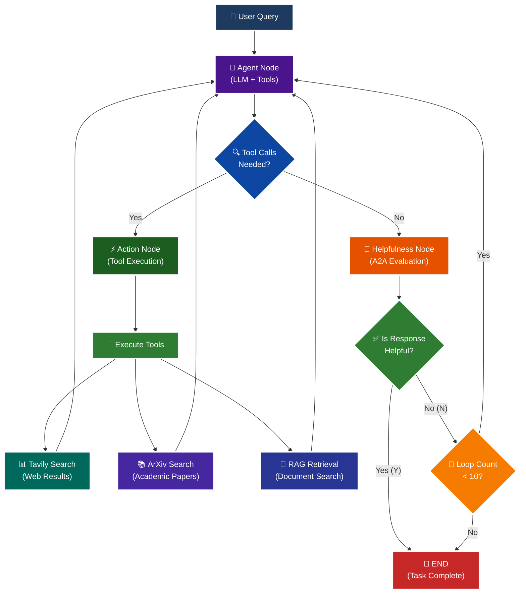

<p align = "center" draggable="false" >
</p>

## <h1 align="center" id="heading">Session 15: Build & Serve an A2A Endpoint for Our LangGraph Agent</h1>

| 🤓 Pre-work | 📰 Session Sheet | ⏺️ Recording     | 🖼️ Slides        | 👨‍💻 Repo         | 📝 Homework      | 📁 Feedback       |
|:-----------------|:-----------------|:-----------------|:-----------------|:-----------------|:-----------------|:-----------------|
| [Session 15: Pre-Work](https://www.notion.so/Session-15-Agent2Agent-Protocol-Agent-Ops-247cd547af3d8066bc5be493bc0c7eda?source=copy_link#247cd547af3d81369191e4e6cd62f875)| [Session 15: Agent2Agent Protocol & Agent Ops](https://www.notion.so/Session-15-Agent2Agent-Protocol-Agent-Ops-247cd547af3d8066bc5be493bc0c7eda) | [Recording!](https://us02web.zoom.us/rec/share/lgZHp8jqB5D5ytsi1gKH-wwdoz6fX0yBlJFOz5tuoGa1TMU0x7e9rKkkH4a75uUx.RC9C31cDG5Bl4UR2) (mttc.$6G)| [Session 15 Slides](https://www.canva.com/design/DAGv5Xxl3Vw/CRpCrhpika6yPjcQHwB_MQ/edit?utm_content=DAGv5Xxl3Vw&utm_campaign=designshare&utm_medium=link2&utm_source=sharebutton) | You are here! | [Session 15 Assignment: A2A](https://forms.gle/RPC6sNh2WXE6984j9) | [AIE7 Feedback 8/12](https://forms.gle/AZT2usWxqzfa1JNc8)

# A2A Protocol Implementation with LangGraph

This session focuses on implementing the **A2A (Agent-to-Agent) Protocol** using LangGraph, featuring intelligent helpfulness evaluation and multi-turn conversation capabilities.

## 🎯 Learning Objectives

By the end of this session, you'll understand:

- **🔄 A2A Protocol**: How agents communicate and evaluate response quality

## 🧠 A2A Protocol with Helpfulness Loop

The core learning focus is this intelligent evaluation cycle:



# Build 🏗️

Complete the following tasks to understand A2A protocol implementation:

## 🚀 Quick Start

```bash
# Setup and run
./quickstart.sh
```

```bash
# Start LangGraph server
uv run python -m app
```

```bash
# Test the A2A Serer
uv run python app/test_client.py
```

### 🏗️ Activity #1:

Build a LangGraph Graph to "use" your application.

Do this by creating a Simple Agent that can make API calls to the 🤖Agent Node above through the A2A protocol. 

#### ✅ Answer:

The script for this is located at app/client_main.py. It can be run with: `uv run python app/client_main.py --prompt <your prompt>`

### ❓ Question #1:

What are the core components of an `AgentCard`?

#### ✅ Answer:

### AgentCard — Core Components

**1) Identity**
- `name` — Human-friendly label for the agent
- `description` — Short capability summary
- `version` — Agent/app version
- `url` — Base URL where the agent is hosted

**2) Protocol & Transport**
- `protocolVersion` — A2A protocol version implemented
- `preferredTransport` — How to communicate (e.g., `JSONRPC`)
- `additionalInterfaces` *(optional)* — Extra supported interfaces

**3) Capabilities**
- `capabilities.streaming` — Supports streamed responses
- `capabilities.pushNotifications` — Can push updates/notifications
- `capabilities.extensions` *(optional)* — Additional feature flags

**4) I/O Modes**
- `defaultInputModes` — Accepted input formats (e.g., `text`, `text/plain`)
- `defaultOutputModes` — Default output formats

**5) Skills** *(what the agent can do)*
Each skill typically has:
- `id` — Stable identifier (e.g., `web_search`, `arxiv_search`, `rag_search`)
- `name` — Human-readable label
- `description` — What the skill does
- `tags` — Quick categorization
- `examples` — Example prompts
- `inputModes` / `outputModes` *(optional)* — Overrides for that skill

**6) Security & Integrity** *(optional / when applicable)*
- `security`, `securitySchemes` — AuthN/AuthZ details
- `supportsAuthenticatedExtendedCard` — Indicates a richer, auth-only card exists
- `signatures` — Integrity/attestation for the card

**7) Metadata & Links** *(optional)*
- `documentationUrl` — External docs
- `iconUrl` — Icon for UIs
- `provider` — Who operates the agent

---

**Client flow (at a glance):** discover the card at `/.well-known/agent-card.json` → configure transport from `preferredTransport`/`capabilities` → shape requests using `defaultInputModes`/`skills` → apply auth if `security` fields are present (and fetch the authenticated/extended card if advertised).


### ❓ Question #2:

Why is A2A (and other such protocols) important in your own words?

#### ✅ Answer:

### Why A2A (and similar protocols) matter — in plain terms

**1) Interoperability by default**
- Shared contract for *how agents talk* (message shapes, streaming, errors), so any compliant client can use any compliant server without glue code.

**2) Discovery instead of hardcoding**
- The **Agent Card** is a self-describing “API brochure” (who I am, what I can do, how to reach me). Clients discover capabilities at runtime instead of baking them into code.

**3) Decoupling & clean boundaries**
- The *client agent* and the *application agent* evolve independently. You can swap models, tools, or hosts behind the server without breaking clients.

**4) Composability of agents**
- Treat agents like services: route, chain, or orchestrate multiple remote agents (e.g., search agent → RAG agent → writing agent) with consistent I/O semantics.

**5) Governance, security, and observability**
- Standard hooks for auth, permissions, auditing, and telemetry; easier to plug into enterprise controls than bespoke JSON-over-HTTP for each project.

**6) Portability across stacks**
- Your client can run in web, CLI, notebook, or backend with the same protocol. Your server can be Python, JS, or anything else—still works.

**7) Reduced coupling to model vendors**
- The protocol abstracts “talk to an agent,” not “call model X directly.” You can change models/tools behind the agent without rewriting clients.

**8) Better failure handling**
- Standard states (e.g., `completed`, `input-required`, `error`) and streaming updates make retries, fallbacks, and UX much cleaner.

---

#### When you might *not* need it
- A single, tightly coupled script where the caller and callee live in the same process and won’t be reused. In that case, direct function calls can be simpler.

---

**In one sentence:** A2A turns agents into discoverable, swappable, and composable services—with a shared language for capabilities, transport, and lifecycle—so you can build faster now and change safely later.

### 🚧 Advanced Build:

<details>
<summary>🚧 Advanced Build 🚧 (OPTIONAL - <i>open this section for the requirements</i>)</summary>

Use a different Agent Framework to **test** your application.

Do this by creating a Simple Agent that acts as different personas with different goals and have that Agent use your Agent through A2A. 

Example:

"You are an expert in Machine Learning, and you want to learn about what makes Kimi K2 so incredible. You are not satisfied with surface level answers, and you wish to have sources you can read to verify information."
</details>

## 📁 Implementation Details

For detailed technical documentation, file structure, and implementation guides, see:

**➡️ [app/README.md](./app/README.md)**

This contains:
- Complete file structure breakdown
- Technical implementation details
- Tool configuration guides
- Troubleshooting instructions
- Advanced customization options

# Ship 🚢

- Short demo showing running Client

# Share 🚀

- Explain the A2A protocol implementation
- Share 3 lessons learned about agent evaluation
- Discuss 3 lessons not learned (areas for improvement)

# Submitting Your Homework

## Main Homework Assignment

Follow these steps to prepare and submit your homework assignment:
1. Create a branch of your `AIE7` repo to track your changes. Example command: `git checkout -b s15-assignment`
2. Complete the activity above
3. Answer the questions above _in-line in this README.md file_
4. Record a Loom video reviewing the changes you made for this assignment and your comparison of the flows (Breakout Room Part #2 - Task 3).
5. Commit, and push your changes to your `origin` repository. _NOTE: Do not merge it into your main branch._
6. Make sure to include all of the following on your Homework Submission Form:
    + The GitHub URL to the `15_A2A_LANGGRAPH` folder _on your assignment branch (not main)_
    + The URL to your Loom Video
    + Your Three lessons learned/not yet learned
    + The URLs to any social media posts (LinkedIn, X, Discord, etc.) ⬅️ _easy Extra Credit points!_

### OPTIONAL: Advanced Build Assignment _(Can be done in lieu of the Main Homework Assignnment)_

Follow these steps to prepare and submit your homework assignment:
1. Create a branch of your `AIE7` repo to track your changes. Example command: `git checkout -b s015-assignment`
2. Complete the requirements for the Advanced Build
3. Record a Loom video reviewing the agent you built and demostrating in action
4. Commit, and push your changes to your `origin` repository. _NOTE: Do not merge it into your main branch._
5. Make sure to include all of the following on your Homework Submission Form:
    + The GitHub URL to the `15_A2A_LANGGRAPH` folder _on your assignment branch (not main)_
    + The URL to your Loom Video
    + Your Three lessons learned/not yet learned
    + The URLs to any social media posts (LinkedIn, X, Discord, etc.) ⬅️ _easy Extra Credit points!_
=======
